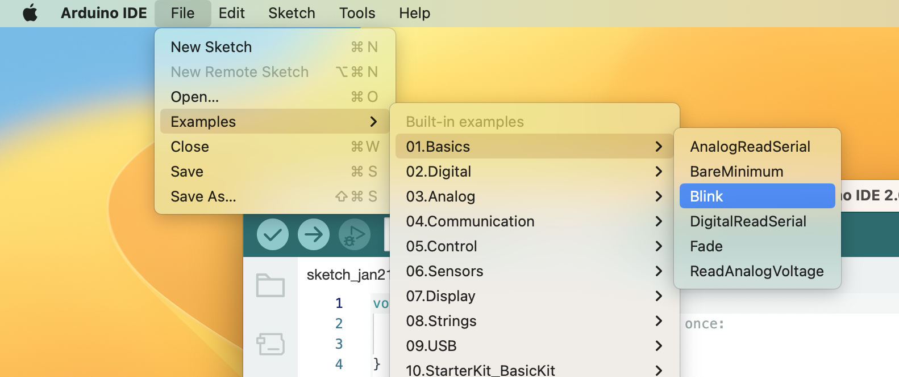
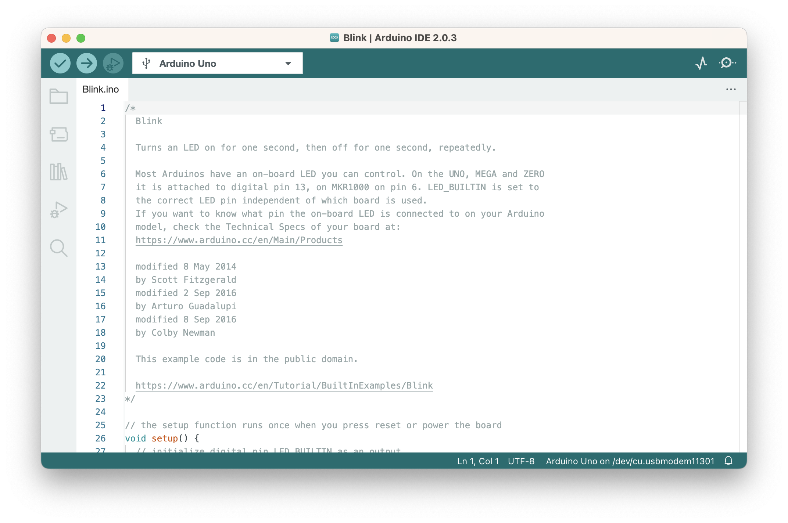
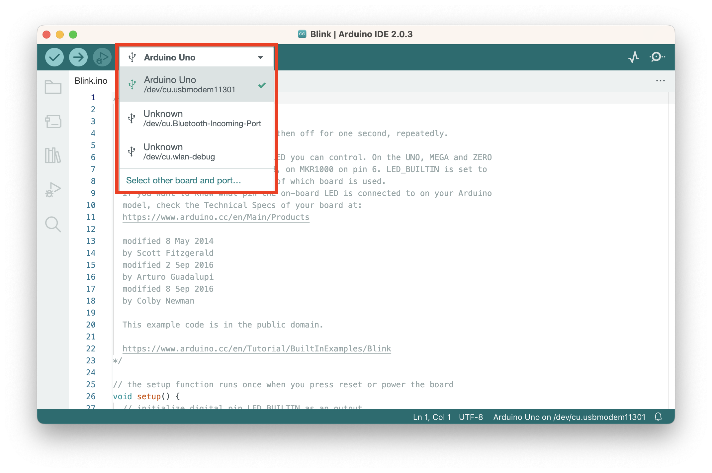
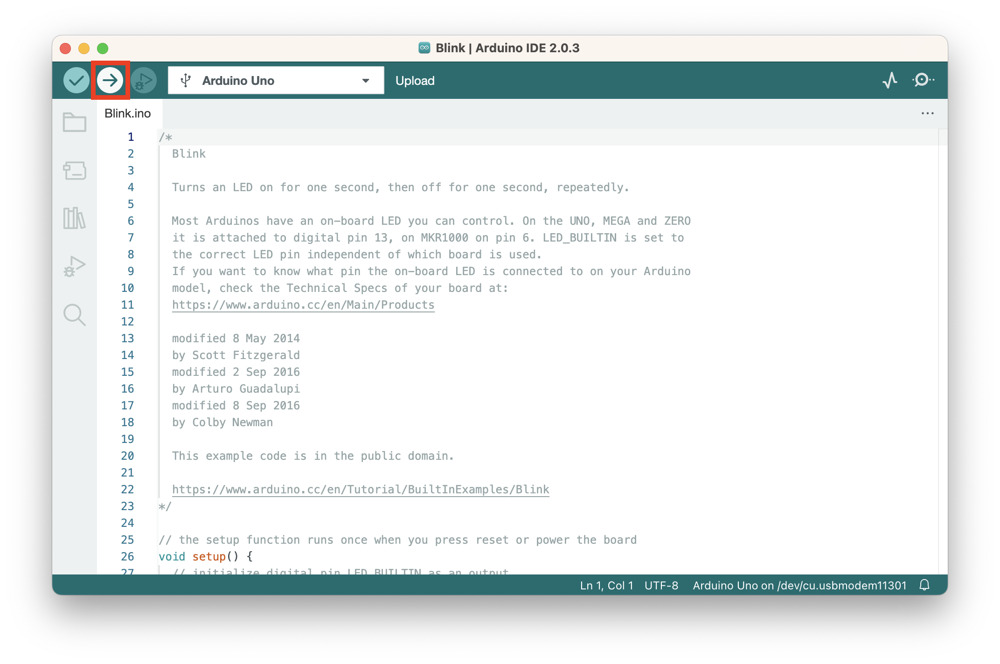
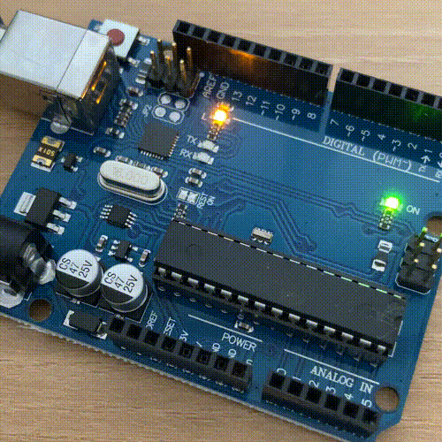

# Hello, World!

아두이노의 `Hello, World!` 프로그램에 해당하는 `Blink` 예제를 실행시켜보겠습니다.

1. 아두이노를 컴퓨터에 연결합니다. 
2. 상단 메뉴 -> File -> Examples -> 01.Basics -> Blink 선택

다음과 같이 새 창이 열리면서 예제 코드가 로드됩니다.

3. 소스 코드를 업로드할 아두이노 보드를 선택합니다.
IDE 창 상단의 Select Board 버튼을 눌러 'Arduino Uno'를 선택하세요.

4. 확인 버튼을 눌러 소스코드를 컴파일하고 오류가 없는지 확인합니다.

하단 `output` 창에 별다른 에러 메시지가 표시되지 않으면 컴파일에 성공한 것입니다. 에러가 있다면 이곳에 에러가 표시됩니다.
5. 에러가 없다면 업로드 버튼을 눌러 소스코드를 컴파일하고 보드에 업로드하세요.

6. 아두이노가 잘 작동하는지 확인합니다.
아래와 같이 보드의 LED가 깜박이면 됩니다.

축하합니다! 🎉 첫 아두이노 프로젝트를 완료했습니다!
