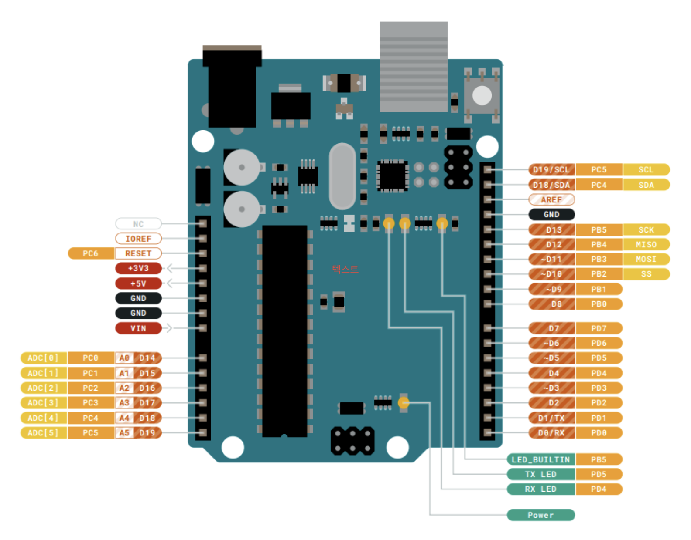
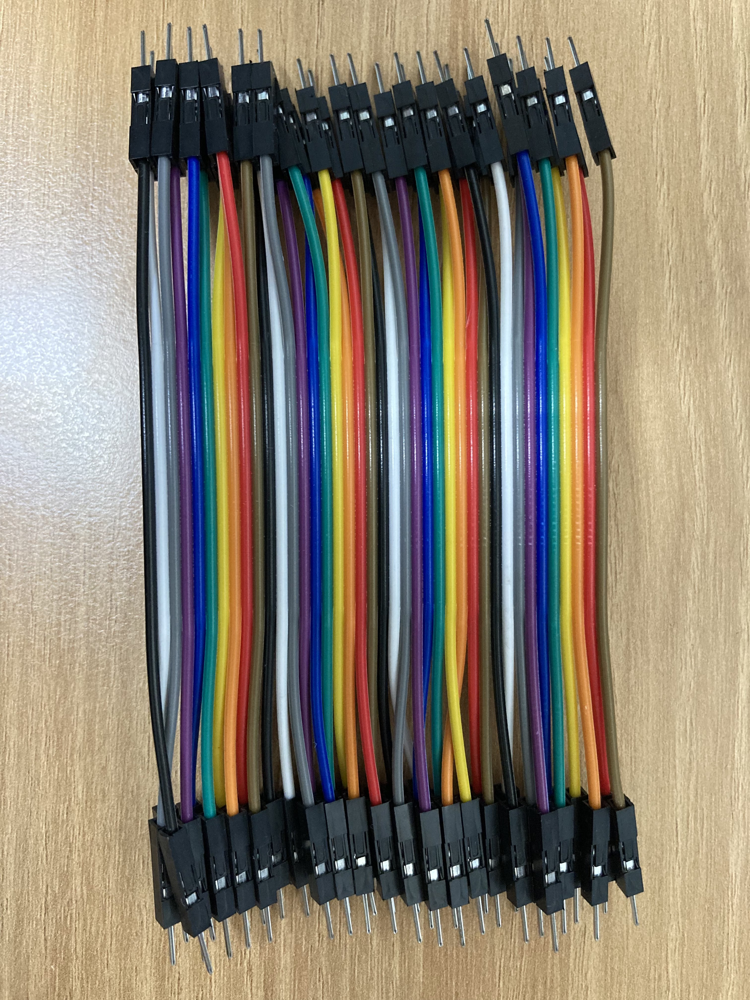
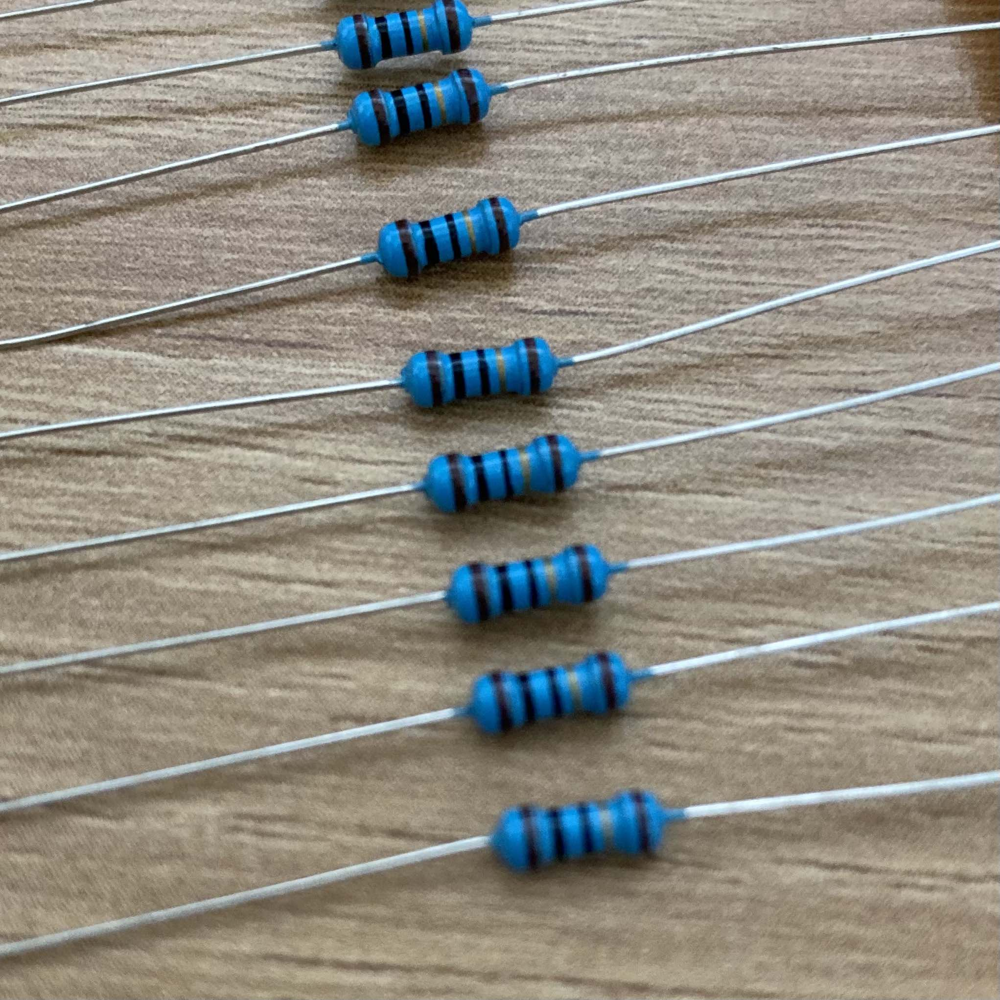

# 아두이노 기초

## 아두이노란
아두이노 누리집에는 다음과 같이 소개되어 있습니다.
> Arduino is an open-source electronics platform based on easy-to-use hardware and software. Arduino boards are able to read inputs - light on a sensor, a finger on a button, or a Twitter message - and turn it into an output - activating a motor, turning on an LED, publishing something online. You can tell your board what to do by sending a set of instructions to the microcontroller on the board. To do so you use the Arduino programming language (based on Wiring), and the Arduino Software (IDE), based on Processing.
> 
> https://www.arduino.cc/en/Guide/Introduction

> 아두이노는 쉽게 사용할 수 있는 하드웨어와 소프트웨어를 바탕으로 한 오픈소스 전자 공학 플랫폼입니다.
> 아두이노 보드는 입력(센서의 빛, 버튼을 누르는 손가락, 트위터 메시지 등)을 읽을 수 있고 그것을 출력(모터를 작동시키고, LED를 키고, 무언가를 온라인으로 내보내기 등)으로 바꿀 수 있습니다. 
> 여러분은 보드의 마이크로컨트롤러에 일련의 명령을 전송함으로써 아두이노 보드에게 무엇을 할지 말해줄 수 있습니다.
> 이를 위해 여러분은 아두이노 프로그래밍 언어와 아두이노 소프트웨어(IDE)를 사용합니다.

### 마이크로컨트롤러
> 마이크로컨트롤러(microcontroller) 또는 MCU(microcontroller unit)는 마이크로프로세서와 입출력 모듈을 하나의 칩으로 만들어 정해진 기능을 수행하는 컴퓨터를 말한다.
>
> CPU 코어, 메모리 그리고 프로그래밍 가능한 입/출력을 가지고 있다. 
>
> MCU는 임베디드 장치을 위해 디자인되었으며 임베디드 시스템에 널리 사용된다. 개인용 컴퓨터가 다양한 요구에 따라 동작하는 범용적인 일에 사용된다면, MCU는 기능을 설정하고 정해진 일을 수행하도록 프로그래밍되어 장치 등에 장착되어 동작한다. 냉장고, 전자레인지, 사무용 전자기기, 리모컨 등의 기기에 사용된다. 
> 
> 위키피디아(한국어) https://ko.wikipedia.org/wiki/마이크로컨트롤러 (일부 수정)

### IDE(통합 개발 환경)
> 통합 개발 환경(IDE)이란 프로그래머가 소프트웨어 코드를 효율적으로 개발하도록 돕는 소프트웨어 애플리케이션입니다. 이는 소프트웨어 편집, 빌드, 테스트, 패키징과 같은 기능을 사용하기 쉬운 하나의 애플리케이션에 통합하여 개발자 생산성을 높입니다. 작가가 텍스트 편집기를 사용하고 회계사가 스프레드시트를 사용하는 것처럼 소프트웨어 개발자는 IDE를 사용해 작업을 쉽게 처리합니다.
> 
> https://aws.amazon.com/ko/what-is/ide/

아두이노 IDE의 경우, 소스코드 편집기, 컴파일 및 업로드 기능, 시리얼 모니터, 라이브러리 관리자 등 여러 도구를 GUI로 사용할 수 있게
제공하고 있어 추가적인 프로그래밍 지식 없이도 쉽게 아두이노 소스 코드를 작성하고 디버깅 할 수 있게 도와줍니다.

### 아두이노 우노 (UNO)
아두이노는 다양한 모양과 사양의 보드가 있습니다.
우노(UNO)는 그 중 가장 기본적인 보드로 아두이노 입문 시 가장 많이 사용합니다.
저희도 우노를 사용할 것입니다.

## 회로

아두이노의 핀과 센서, 모터 등 부품의 핀을 연결해 회로를 만듭니다.

> 회로를 만들 때는 아두이노를 컴퓨터에서 분리해주세요. 

### 아두이노 핀


- 디지털 핀(D_): 위의 사진 기준 오른쪽에 있는 핀. HIGH/LOW 두 개의 디지털 신호를 입/출력 할 수 있는 핀
- PWM: 틸트(~)가 있는 디지털 핀. PWM 제어 가능
- 아날로그 핀(A_): 위의 사진 기준 왼쪽 하단에 있는 핀. 0~255 사이의 연속적인 아날로그 신호를 입력 받을 수 있는 핀
- 3.3V/5V: 위의 사진 기준 왼쪽 상단에 있음. 해당 전압을 내보내는 핀.
- GND: 위의 사진 기준 왼쪽 상단에 2개, 오른쪽 상단에 1개 있음. GROUND 핀. 0V에 해당.

### 브레드보드 (빵판)
납땜 없이 전선을 연결하기 위해 사용합니다. 학습 시나 프로토타이핑 시 주로 사용합니다.

저희는 400핀짜리 브레드보드를 사용합니다.


빨간 선으로 연결되어 있는 홈들이 서로 연결되어 있습니다.

### 점퍼 와이어

아두이노와 브레드보드로 작업할 때 사용하는 전선. 하나씩 떼서 양 끝을 각각 아두이노와 브레드보드, 센서 등에 연결하면 됩니다.



### 저항

통합과학/물리 시간에 이야기하던 그 저항. 띠의 색에 따라 저항 크기가 다릅니다. 읽는 법 궁금하면 구글링 해보세요.

보통 양 끝을 접어서 `ㄷ`자를 만들어서 브레드보드에 연결해 사용합니다.



## 아두이노 프로그래밍 언어

아두이노 프로그래밍 언어는 C++언어와 유사합니다.

### 기본
기본 골격은 다음과 같습니다. 
```c
void setup() {
  // 이 함수는 아두이노가 실행되었을 때 처음 한 번만 실행됩니다.
  // 한 번만 실행하고 싶은 코드를 이곳에 작성합니다.
  // 보통 초기화, 센서 연결 등의 작업을 수행합니다.
}

void loop() {
  // 이 함수는 계속 반복해서 실행됩니다.
  // 센서로부터 값을 읽고, 처리하고, 다른 장치로 출력하는 등 메인 작업을 이곳에 작성합니다.
}
```

`setup` 함수와 `loop` 함수는 c언어의 `main` 함수처럼 아두이노가 자동으로 호출합니다.

`setup()` -> `loop()` -> `loop()` -> `loop()` -> ... 와 같은 느낌으로 생각하면 됩니다.

### 변수
```cpp
    int foo;
//  ^^^ ^^^
//  타입  변수명
foo = analogRead(0); // 대입

int foo = 5; // 한번에

// 타입: int, long, bool, String 등
```

### 함수 호출
```cpp
// 세미콜론 필요하다는 점 주의
함수명(인자1, 인자2, ...);
```

### 제어문
#### 조건문
```cpp
if (condition1) {
  // do Thing A
}
else if (condition2) {
  // do Thing B
}
else {
  // do Thing C
}
```
#### 반복문(for)
```cpp
for (initialization; condition; increment) {
  statement(s);
}
for (int i = 0; i <= 255; i++) {
  analogWrite(PWMpin, i);
  delay(10);
}
```

[레퍼런스](https://www.arduino.cc/reference/en/)에서 더 자세히 알아보세요.
