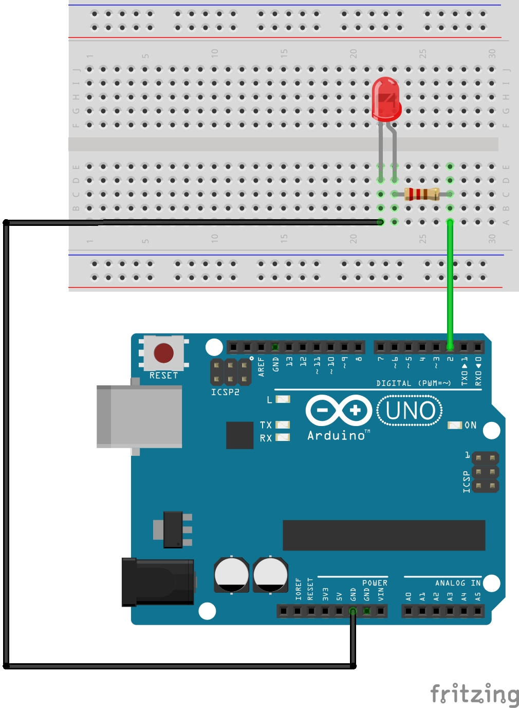
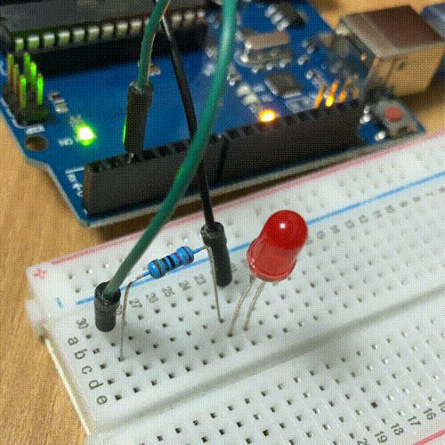

# LED 제어하기

## 회로도


## 소스코드
```cpp
int LED_PIN = 2;

void setup() {
  pinMode(LED_PIN, OUTPUT);
}

void loop() {
  digitalWrite(LED_PIN, HIGH);
  delay(1000);
  digitalWrite(LED_PIN, LOW);
  delay(1000);
}
```

### pinMode 함수
특정 핀이 입력 모드로 작동할지, 출력 모드로 작동할지 지정합니다.
```cpp
pinMode(핀번호, 모드)
```
- 핀번호: 입력 모드를 지정할 아두이노 핀의 번호
- 모드:
  - `INPUT`: 입력 모드 (= 이 핀으로 디지털 신호를 입력받을 거에요!)
  - `OUTPUT`: 출력 모드 (= 이 핀으로 디지털 신호를 출력할 거에요!)
  - `INPUT_PULLUP`

[레퍼런스](https://www.arduino.cc/reference/en/language/functions/digital-io/pinmode/)

### digitalWrite 함수
디지털 핀을 `HIGH` 또는 `LOW`로 설정합니다.
핀이 `OUTPUT`으로 설정되어 있다면, `HIGH`일 때 5V(UNO 기준)를 출력하고, `LOW`일 때 0V를 출력합니다.

```cpp
digitalWrite(핀번호, 값)
```
- 핀번호: 아두이노 핀 번호
- 모드:
  - `HIGH`
  - `LOW`

[레퍼런스](https://www.arduino.cc/reference/en/language/functions/digital-io/digitalwrite/)

### delay 함수
프로그램을 입력된 시간만큼 멈춥니다.

```cpp
delay(시간)
```
- 시간: 기다릴 시간(밀리초, 1000ms == 1s)

[레퍼런스](https://www.arduino.cc/reference/en/language/functions/time/delay/)

## 결과
