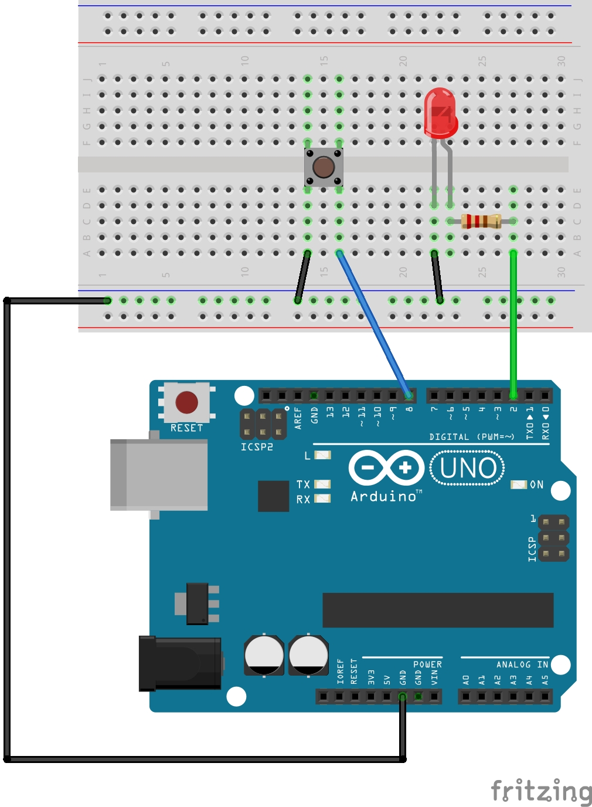
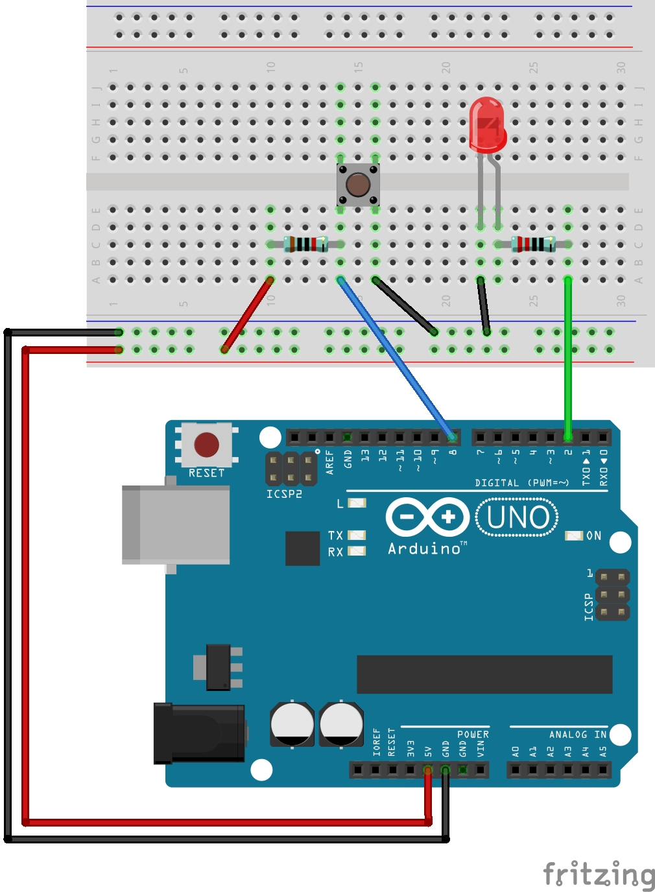
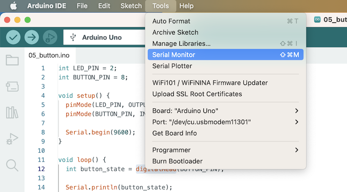

# 버튼 사용하기

버튼을 누르면 LED가 켜지도록 만들어봅시다.

디지털 입력을 받는 법과 시리얼 통신에 대해 알아봅니다.

## 준비물
- 아두이노 우노
- LED
- 220옴 저항
- 수수 점퍼와이어
- 푸시 버튼
- (선택) 10k옴

## 회로도


## 소스코드
```cpp
{{#include ../../arduino/05_button/05_button.ino}}
```

## 설명

### 푸시 버튼

버튼 내부 회로가 `H`자로 구성되어 있어 버튼을 누르면
다리 4개가 모두 연결되어 전류가 흐르고, 버튼을 누르지 않으면 전류가 흐르지 않습니다.

### INPUT_PULLUP

버튼과 연결된 디지털핀의 핀모드를 `INPUT_PULLUP`으로 설정했습니다. 
이는 `해당 핀을 입력 모드로 사용할건데, 내장된 풀업 회로를 사용할거야` 라는 의미입니다.

왜 풀업 회로를 사용하지 않을 경우, 버튼을 누르지 않았을 때 입력값이 HIGH와 LOW 사이에서 무작위로 계속 바뀌는 `floating` 현상이 나타납니다. 이를 방지하기 위한 회로가 풀업 회로입니다. 참고로 풀다운 회로도 있으며, 역할은 풀업 회로와 동일합니다.

만약 내장 풀업 회로를 사용하지 않고 직접 회로를 구성한다면 다음과 같습니다.



참고로 풀업 회로는 회로가 연결되지 않았을 때(버튼이 눌리지 않았을 때) HIGH로 고정시키는 회로이므로,
위 코드에서 버튼에서 읽은 디지털 값이 LOW일 때 LED가 켜지도록 했습니다.

### digitalRead 함수
특정 핀으로부터 디지털 값을 읽습니다.
```cpp
digitalRead(핀번호)
```
- 핀번호: 값을 읽고 싶은 핀 번호

[레퍼런스](https://www.arduino.cc/reference/en/language/functions/digital-io/digitalread/)

### Serial 통신
통신 규약 중 하나로 아두이노와 컴퓨터가 서로 통신할 때 사용할 수 있습니다.
파이썬에서 `print` 함수로 값을 출력하며 디버깅 하듯이 아두이노에서는 시리얼 통신을 통해 값을 출력하며 디버깅 할 수 있습니다.

시리얼 통신을 위해선 우선 시리얼 통신을 하겠다고 이야기하며 설정을 해주어야 합니다.
위 코드 중 `setup` 함수의 [`Serial.begin(9600)`](https://www.arduino.cc/reference/en/language/functions/communication/serial/begin/)이 바로 그것입니다.
여기서 9600은 통신 속도로 초당 비트수(bps) 단위로 작성합니다. 통신 상대도 같은 속도로 지정해야 올바르게 정보를 주고받을 수 있습니다.

[`Serial.println` 함수](https://www.arduino.cc/reference/en/language/functions/communication/serial/println/)를 통해서
값을 컴퓨터로 보낼 수 있습니다. 인자로 전송하고 싶은 값을 넣으면 됩니다.



아두이노 IDE의 상단 메뉴 -> Tools -> Serial Monitor를 통해 시리얼 모니터를 키면 아두이노가 전송한 값들을 확인 할 수 있습니다.


## 더 나아가기

- 토글 버튼으로 만들기

  버튼을 한 번 누르면 LED가 켜지고, 다시 한 번 누르면 LED가 꺼진다.

