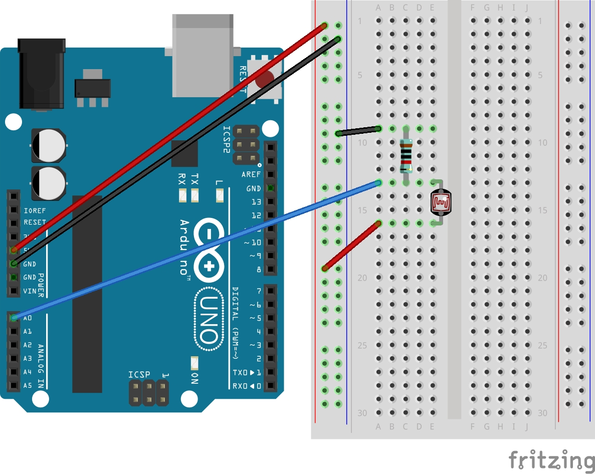

# 조도 센서 사용하기

조도 센서를 이용해 주변 빛의 세기를 알아내봅시다.

아날로그 입력 받는 방법을 알아봅니다.

## 준비물
- 아두이노 우노
- 조도 센서
- 10k옴
- 수수 점퍼와이어

## 회로도


## 소스코드
```cpp
{{#include ../../arduino/06_light/06_light.ino}}
```

## 설명

### 조도 센서

빛의 크기에 따라 저항 값이 바뀌는 센서입니다.

### analogRead 함수
특정 핀으로부터 아날로그 값을 읽습니다. 0 ~ 1023 사이의 값을 반환합니다.
```cpp
analogRead(핀번호)
```
- 핀번호: 값을 읽고 싶은 핀 번호 (`A + 숫자` 형식. eg. `A0`)

[레퍼런스](https://www.arduino.cc/reference/en/language/functions/analog-io/analogread/)

